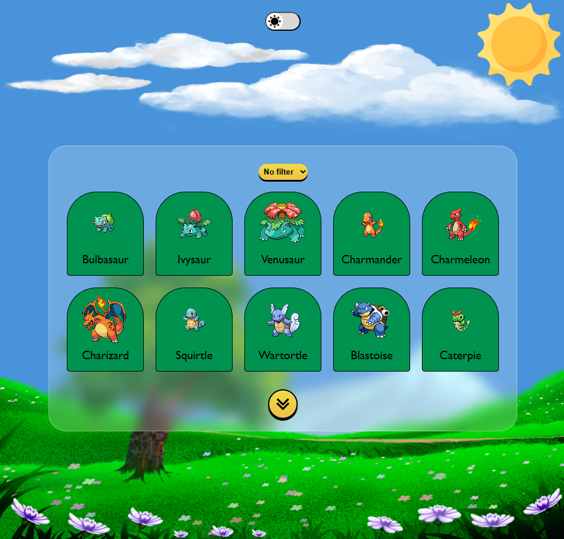

# Pokedex

> Uma aplicação web que permite explorar e visualizar Pokémons de forma interativa, trazendo tanto uma lista navegável quanto uma página dedicada que simula uma carta Pokémon detalhada.



---

## Sumário
- [Propósito da aplicação](#propósito-da-aplicação)
- [Funcionalidades entregues](#funcionalidades-entregues)
- [Ferramentas utilizadas e por que foram escolhidas](#ferramentas-utilizadas-e-por-que-foram-escolhidas)
- [Decisões de planejamento e execução (com justificativas)](#decisões-de-planejamento-e-execução-com-justificativas)
- [Como rodar o projeto](#como-rodar-o-projeto)
- [Scripts disponíveis](#scripts-disponíveis)
- [Estrutura de pastas](#estrutura-de-pastas)
- [Autor e licença](#autor-e-licença)

---

## Propósito da aplicação
A Pokedex foi desenvolvida para consumir a [PokéAPI](https://pokeapi.co/) e exibir Pokémons de maneira simples e visualmente agradável. O objetivo é simular a experiência de navegar por uma Pokedex interativa, explorando tanto uma lista de criaturas quanto detalhes individuais através de uma carta estilizada.

---

## Funcionalidades entregues
- [x] Página inicial exibindo a lista de Pokémons com scroll.
- [x] Navegação entre rotas usando **React Router** (Home / Detalhes do Pokémon).
- [x] Página de detalhes de Pokémon simulando uma **carta Pokémon**, com informações posicionadas de forma fiel.
- [x] **Tema Light e Dark**, alternando entre cenários: dia (sol e nuvens) e noite (lua e estrelas).
- [x] Layout responsivo utilizando **aspect-ratio** para manter proporções visuais da carta.
- [x] Comunicação com API externa usando **Axios**.
- [x] Estilização com **styled-components**.
- [x] Estado global e troca de tema com **Context API**.
- [x] Testes unitários com **Jest**.

---

## Ferramentas utilizadas e por que foram escolhidas
- **React + Vite** — Rápida prototipação, HMR e build otimizado.
- **React Router** — Navegação simples entre páginas (lista e carta).
- **Axios** — Requisições HTTP mais práticas, interceptors e bom tratamento de erros.
- **styled-components** — Estilização escopada por componente, suporte a props e theming dinâmico.
- **Context API** — Gerenciamento simples de estado global (tema claro/escuro) sem overhead.
- **Jest** — Testes confiáveis de componentes e funcionalidades principais.

---

## Decisões de planejamento e execução (com justificativas)

### 1) Responsividade com `aspect-ratio`
- **Problema**: o container da carta ficava maior que a imagem de fundo em alguns dispositivos, quebrando o layout.
- **Decisão**: usar `aspect-ratio: 100/140` para manter a proporção exata do background.
- **Justificativa**: solução nativa em CSS, elimina hacks com `vh` e mantém o design consistente em qualquer tela.

### 2) Temas Light/Dark com Context API
- **Decisão**: criar dois cenários distintos — dia (com sol e nuvens) e noite (com lua e estrelas).
- **Justificativa**: além de estética, reforça a identidade do projeto e valoriza a experiência do usuário.

### 3) Página de carta do Pokémon
- **Decisão**: representar os detalhes do Pokémon através de uma carta estilizada.
- **Desafio**: posicionar cada informação em locais específicos da carta.
- **Solução**: uso de `position: absolute` para garantir a fidelidade visual.

### 4) Organização por componentes
- Separação em componentes (`Container`, `Card`, `Header`, etc.), garantindo reuso e manutenção facilitada.

---

## Como rodar o projeto

### Pré-requisitos
- **Node.js** 18+
- **npm** (ou yarn/pnpm)

### Passo a passo
```bash
# 1) Clonar o repositório
git clone https://github.com/Lucas-Madeira78/pokedex.git
cd pokedex

# 2) Instalar dependências
npm install

# 3) Rodar em desenvolvimento
npm run dev

# 4) Gerar build de produção
npm run build

# 5) Pré-visualizar o build
npm run preview
```

---

## Scripts disponíveis
```json
{
  "scripts": {
    "test": "jest",
    "dev": "vite",
    "build": "vite build",
    "lint": "eslint .",
    "preview": "vite preview"
  }
}
```

---

## Estrutura de pastas
```bash
src/
  components/     # componentes reutilizáveis
  constants/      # variaveis globais para a carta e icones
  context/        # gerenciamento de tema
  pages/          # páginas Home e Card
  services/       # requesições para a Api
  styles/         # estilos globais
  App.jsx
  main.jsx
```

---

## Autor e licença
**Autor:** Lucas Madeira (@Lucas-Madeira78)

**Licença:** MIT